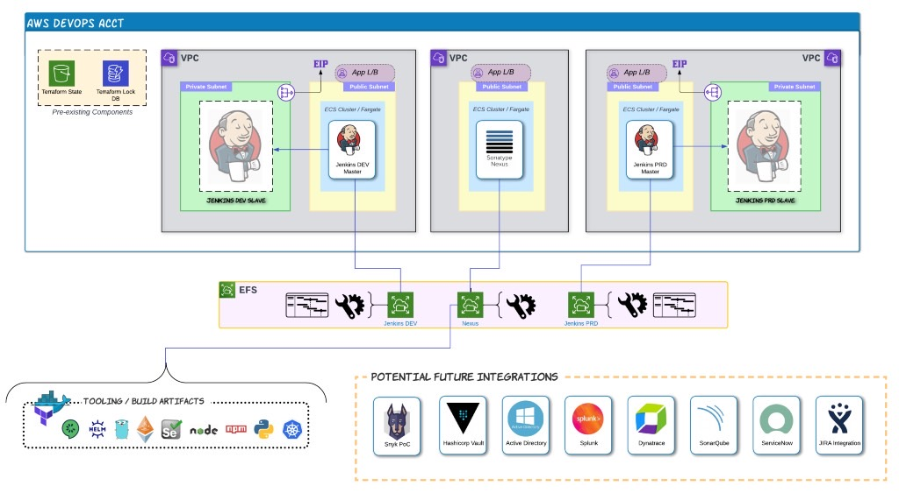

# Overview



This repository contains Terraform definitions for repeated AWS infrastructure to be deployed across multiple accounts.    

## Environment Definitions

Platforms are configured by creating a subdirectory (e.g. 'DEV') containing two primary sets of values.  The prefix for each filename must match the directory.  Required files:

- `DEV-backend.tfvars`: account-specific configuration
- `DEV.tfvars`: platform component configuration

**DEV-backend.tfvars**

- `bucket` = S3 Bucket for Terraform State
- `key` = Name of state file (must be unique per platform)
- `dynamodb_table` = DynamoDB table for Terraform lock
- `region` = Region to deploy into
- `role_arn` = Role that will be assumed by Terraform to deploy infrastructure

_Example:_

```
bucket = "peodev-667873832206-tf-state"
key = "MVP-Jenkins-Platform.tfstate"
dynamodb_table = "peodev-667873832206-tf-lock-table"
region = "ap-southeast-2"
role_arn = "arn:aws:iam::667873832206:role/OrganizationAccountAccessRole"
```

**DEV.tfvars**

- `vpc_defs`: list of maps describing one or more VPC definitions

VPC definition data structure:

{

- `name`: prefix/suffix to include in Names and Tags
- `cidr`: VPC CIDR range

- `azs`: list of AZs to deploy into
- `private_subnets`: list of private subnet CIDR ranges (can be empty set)
- `public_subnets`: list of public subnet CIDR ranges (can be empty set)

- `enable_nat_gateway`: create NAT gateway for private subnets (true/false)
- `single_nat_gateway`: create single NAT gateway for all AZs (true/false)
- `one_nat_gateway_per_az`: set to false if the above is true

- `access_point`: directory path for Access Point

- `docker_image`: image to deploy as Fargate task within ECS
- `app_ports`: ports utilized by application
- `subdomains`: subdomains to associate with app ports (match order in port list)
- `health_check_path`: path for load balancer health check
- `container_mount`: path within container to mount EFS
- `port_mappings`: application to container port mappings
- `port_tg`: ALB listener rules mapping port to target group

}

- `peering_pairs`: map of tuples in the form `name = [ from_vpc_indx, to_vpc_indx ]` _Note: can be empty set if no VPC Peering connections required_

_Example:_

```
vpc_defs = [ 
  {
      # JENKINS DEV VPC and APP
      name = "jdev"
      cidr = "10.16.3.0/24"

      azs             = ["ap-southeast-2a", "ap-southeast-2b"]
      private_subnets = ["10.16.3.0/27", "10.16.3.32/27"]
      public_subnets  = ["10.16.3.128/27", "10.16.3.160/27"]

      enable_nat_gateway = true
      single_nat_gateway = true
      one_nat_gateway_per_az = false

      access_point = "/efs/jenkins_dev"

      docker_image = "jenkins/jenkins:2.400-jdk11"
      app_ports = [ 8080 ]
      subdomains = [ "jenkinsdev" ]
      health_check_path = "/login"
      container_mount = "/var/jenkins_home"
      port_mappings = [
          {
          containerPort = 8080
          hostPort      = 8080
          }
      ]
      port_tg = {
          8080 = 0
      }

  },
  {
      # NEXUS VPC and APP
      name = "nxs"        
      cidr = "10.16.4.0/24"

      azs             = ["ap-southeast-2b", "ap-southeast-2c"]
      private_subnets = []
      public_subnets  = ["10.16.4.128/27", "10.16.4.160/27"]

      enable_nat_gateway = false 
      single_nat_gateway = false 
      one_nat_gateway_per_az = false

      access_point = "/efs/nexus"

      docker_image = "sonatype/nexus3:latest"
      app_ports = [ 8081, 8082 ]
      subdomains = [ "nexus", "docker" ]
      health_check_path = "/service/rest/v1/status" 
      container_mount = "/opt/sonatype/sonatype-work/nexus3"
      port_mappings = [
          {
          containerPort = 8081
          hostPort      = 8081
          },
          {
          containerPort = 8082
          hostPort      = 8082
          }            
      ]
      port_tg = {
          8081 = 0
          8082 = 1
      }
 
  }
]

peering_pairs = {
    jdev_to_nexus = [0, 1]
}
```

## Usage

### Prerequisites

The repository is designed to be deployed from the command line on a local machine.  The following are required:

* AWS CLI Credentials for an IAM user that has permissions to assume roles defined in the target account
* The role in the target account must have a trust relationship with the IAM user defined above
* An S3 bucket and DynamoDB table in the target account for Terraform state
* Terraform and AWS CLI installed on the local machine
* [Optional] Docker installed if using the 'terraform-deploy' image rather than local tooling

### Command Execution

The repositoy includes the 'tf-run' helper script to streamline the init/plan/apply of Terraform.

```
Usage:
  ./tf-run <Terraform command> <Target AWS Account>

Where:
   * Terraform command == init|plan|apply|destroy
   * Target AWS Account == DEV|PRD, etc.
```

Example of complete deploy sequence:

```
   ./tf-run init DEV
   ./tf-run plan DEV
   ./tf-run apply DEV
```
