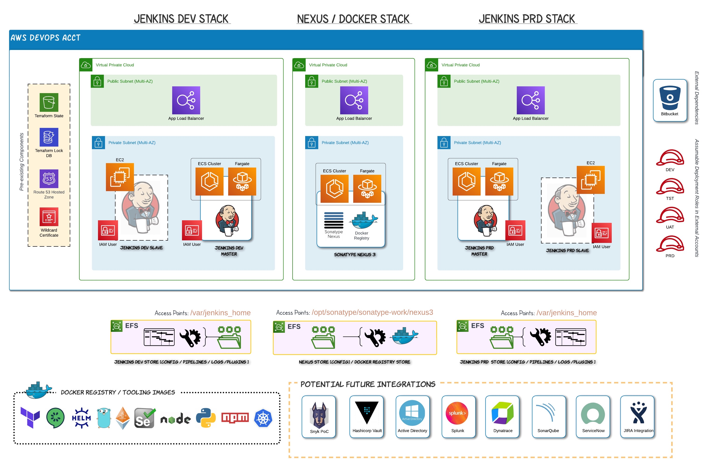

# Overview

## Core Architecture



This repository contains Terraform definitions for a configurable, fully-functional CI/CD framework including two Jenkins Environments (DEV and PRD) sharing a central Nexus Artifact Repository for Docker Tooling Images.    

## Environment Definitions

Platforms are configured by creating a subdirectory (e.g. 'JDEV') containing two primary sets of values:
1) a backend configuration defining an S3 bucket, DynamoDB table and state file 'key'
2) configuration for either a Jenkins or Nexus applicaton stack

The prefix for each filename must match the directory.  Example filenames:

- `JDEV-backend.tfvars`: account-specific configuration
- `JDEV.tfvars`: stack component configuration

**JDEV-backend.tfvars**

- `bucket` = S3 Bucket for Terraform State
- `key` = Name of state file (must be unique per platform)
- `dynamodb_table` = DynamoDB table for Terraform lock
- `region` = Region to deploy into
- `role_arn` = Role that will be assumed by Terraform to deploy infrastructure

_Example:_

```
bucket = "neuralessence-tfstate"
key = "jenkins/Jenkins-DEV-Stack.tfstate"
dynamodb_table = "neuralessence_tflock"
region = "ap-southeast-2"
role_arn = "arn:aws:iam::339285943866:role/Terraform-Bootstrap"
```

**JDEV.tfvars**

_Name/Tag Tokens:_

- `tenant`: Example: `nrl`
- `application`:  Example: `cicd`
- `environment`: Example: `demo`

_Platform Configurations_

- `hz_name`: SSM Parameter key (e.g. `/jenkins/dns/neural-zone-name`) holding the Hosted Zone name on which to pre-pend subdomains for individual services (Example: `jenkins.neuralessence.com`)
- `cert_arn`: SSM Parameter key (e.g. `/jenkins/cert/neural-wildc-cert-arn`) holding the Wildcard SSL certificate ARM to associate with ALB ingress parths (Example: `arn:aws:acm:ap-southeast-2:339285943866:certificate/6997e1d3-1ff5-4905-a38b-e4be3d46ba9b`) 
- `stack_defs`: list of maps describing one or more Stack definitions

Stack definition data structure:

{

- `app_type`: free-form token to indicate stack application (currently `jenkins` and `nexus` are used)
- `name`: prefix/suffix to include in Names and Tags
- `cidr`: VPC CIDR range
- `azs`: list of AZs to deploy into
- `private_subnets`: list of private subnet CIDR ranges (can be empty set)
- `public_subnets`: list of public subnet CIDR ranges (can be empty set)
- `enable_nat_gateway`: create NAT gateway for private subnets (true/false)
- `single_nat_gateway`: create single NAT gateway for all AZs (true/false)
- `one_nat_gateway_per_az`: set to false if the above is true
  
- `whitelist_ips`: a list of IPs (e.g. `101.98.162.108/32`) to be whitelisted for HTTPS access to the stack URL

- `docker_image`: image to deploy as Fargate task within ECS
- `command`: list of srtings to pass to the Docker run command after the image (equivalent to `CMD`)
- `app_ports`: ports utilized by application
- `subdomains`: subdomains to associate with app ports (match order in port list)
- `port_mappings`: application to container port mappings
- `health_check_path`: path for load balancer health check
- `access_point`: directory path for Access Point
- `container_mount`: path within container to mount EFS
- `port_tg`: ALB listener rules mapping port to target group

- `create_iam`: True/False flag to indicate creation of IAM Users for Jenkins Master, Jenkins Slave and a sample deployment role
- `iam_components`: 

    - `stack_env`: modifier to generate unique names for IAM components (e.g. `dev`)
    - `jenkins_master_policy`: path to JSON file with properly formatted IAM Policy definition to attach to Jenkins Master IAM User (e.g. `/JDEV/Jenkins-Master-IAM-Policy.json`)
    - `deployment_role_policy`: path to JSON file with property formatted IAM Policy definition to attach to the Terraform Assumeable Role in the current acocunt (e.g. `/JDEV/Deployment-Role-Policy.json`)

- `assumable_roles`: list of Role ARNs that can be Assumed by the Jenkins Slave Agent (typically in other accounts)

}

- `peering_pairs`: map of tuples in the form `name = [ from_vpc_indx, to_vpc_indx ]` _Note: can be empty set if no VPC Peering connections required_

_Examples of Jenkins and Nexus Configuration:_

```
stack_defs = [ 
    {
        # JENKINS DEV APP STACK
        app_type = "jenkins"
        name = "jdev"
        cidr = "10.16.3.0/24"

        azs             = ["ap-southeast-2a", "ap-southeast-2b"]
        private_subnets = ["10.16.3.0/27", "10.16.3.32/27"]
        public_subnets  = ["10.16.3.128/27", "10.16.3.160/27"]

        enable_nat_gateway = true
        single_nat_gateway = true
        one_nat_gateway_per_az = false

        access_point = "/efs/jenkins_dev"

        # List of IPs to Whitelist for Load Balancer Ingress
        whitelist_ips = []        

        docker_image = "jenkins/jenkins:2.406-jdk11"
        command = [
            "--accessLoggerClassName=winstone.accesslog.SimpleAccessLogger",
            "--simpleAccessLogger.format=combined",
            "--simpleAccessLogger.file=/var/jenkins_home/logs/access.log",
        ]
        app_ports = [ 8080 ]
        subdomains = [ "dev" ]
        health_check_path = "/login"
        container_mount = "/var/jenkins_home"
        port_mappings = [
            {
            containerPort = 8080
            hostPort      = 8080
            },
            {
            containerPort = 50000
            hostPort      = 50000
            }            
        ]
        port_tg = {
            8080 = 0
        }

        # IAM Components
        create_iam    = true
        iam_components = {
            stack_env              = "dev"
            jenkins_master_policy  = "/JDEV/Jenkins-Master-IAM-Policy.json"
            deployment_role_policy = "/JDEV/Deployment-Role-Policy.json"
        }
        # List of Role ARNs that can be Assumed by the Jenkins Slave Agent (typically in other accounts)
        assumable_roles        = [ "arn:aws:iam::339285943866:role/Terraform-Bootstrap" ]

        task_role = true
        task_role_policy = "/iam_policies/Task-DockerExec-Policy.json"
    },
     {
        # NEXUS APP STACK
        app_type = "nexus"
        name = "nxs"        
        cidr = "10.16.4.0/24"

        azs             = ["ap-southeast-2b", "ap-southeast-2c"]
        private_subnets = ["10.16.4.0/27", "10.16.4.32/27"]
        public_subnets  = ["10.16.4.128/27", "10.16.4.160/27"]

        enable_nat_gateway = true 
        single_nat_gateway = true 
        one_nat_gateway_per_az = false

        access_point = "/efs/nexus"

        # List of IPs to Whitelist for Load Balancer Ingress
        whitelist_ips = []

        docker_image = "sonatype/nexus3:latest"
        app_ports = [ 8081, 8082 ]
        subdomains = [ "nexus", "docker" ]
        health_check_path = "/service/rest/v1/status" 
        container_mount = "/opt/sonatype/sonatype-work/nexus3"
        port_mappings = [
            {
            containerPort = 8081
            hostPort      = 8081
            },
            {
            containerPort = 8082
            hostPort      = 8082
            }            
        ]
        port_tg = {
            8081 = 0
            8082 = 1
        }

        # IAM Components
        create_iam      = false
        iam_components  = {}
        assumable_roles = []   

        task_role = true
        task_role_policy = "/iam_policies/Task-DockerExec-Policy.json"
    }, 
]

peering_pairs = {
    jdev_to_nexus = [0, 1]
}
```

**IAM Policy Definitions**

IAM Policy definitons are saved to individual files for re-use and ease of editing.  File references in `jenkins_master_policy` and `deployment_role_policy` are relative to `path.root` so they can be anywhere within the directory tree.  _Note: by convention these files use the `.json` suffix._

## Usage

### Prerequisites

The repository is designed to be deployed from the command line on a local machine.  The following are required:

* AWS CLI Credentials for an IAM user that has permissions to assume roles defined in the target account
* The role in the target account must have a trust relationship with the IAM user defined above
* An S3 bucket and DynamoDB table in the target account for Terraform state
* Route 53 Hosted Zone
* Wildcard cerificate for Hosted Zone to cover all subdomains
* Terraform and AWS CLI installed on the local machine
* [Optional] Docker installed if using the 'terraform-deploy' image rather than local tooling

### Command Execution

The repositoy includes the 'tf-run' helper script to streamline the init/plan/apply of Terraform.

```
Usage:
  ./tf-run <Terraform command> <Target AWS Account>

Where:
   * Terraform command == init|plan|apply|destroy
   * Target AWS Account == DEV|PRD, etc.
```

Example of complete deploy sequence for Jenkins DEV:

```
   ./tf-run init JDEV
   ./tf-run plan JDEV
   ./tf-run apply JDEV
```

# Appendix

## Network Interconnectivity

See README file in `modules/security-groups` for Network Interconnectivity Reference diagram.
